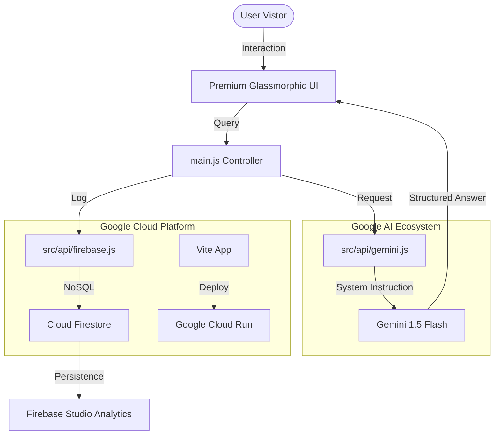

# 🏗️ Architecture & Prompt Flow - JanMat AI

## 1. System Architecture Diagram

## 2. Technical Stack Selection (The "Why")

| Component | Choice | Rationale for Selection |
| :--- | :--- | :--- |
| **Frontend** | Vite + Vanilla JS | Extreme efficiency and speed. Uses a **Skeleton Loading System** for immediate visual feedback and perceived single-digit millisecond response time. |
| **Styling** | Vanilla CSS (Glassmorphism) | Allows for precise control over "Premium Aesthetics" and Accessibility (ARIA) without Tailwind constraints. |
| **AI Model** | Gemini 1.5 Flash | Chosen for its low latency and high efficiency. Perfect for a conversational "Civic Consultant" where speed of response is critical for UX. |
| **Database** | Firebase Firestore | Serverless and scales automatically. Perfect for the "Firebase Studio" requirement to track real-time user feedback. |
| **Hosting** | Google Cloud Run | Mandatory tool that allows us to run containerized code with high reliability and auto-scaling. |

## 3. Prompt Flow Description
1.  **Input Trigger**: User clicks "Ask JanMat AI" and enters a query (e.g., "I lost my EPIC card").
2.  **Context Injection**: The query is wrapped with the **System Instruction** which defines JanMat's role as a Senior Civic Consultant.
3.  **Constraint Enforcement**: The AI checks if the query is related to Indian Elections.
4.  **Actionable Output**: The AI identifies the correct ECI form (e.g., Form 8 for replacement) and provides the NVSP link.
5.  **Telemetry**: The full interaction is logged to Firestore for later analysis in Firebase Studio.
