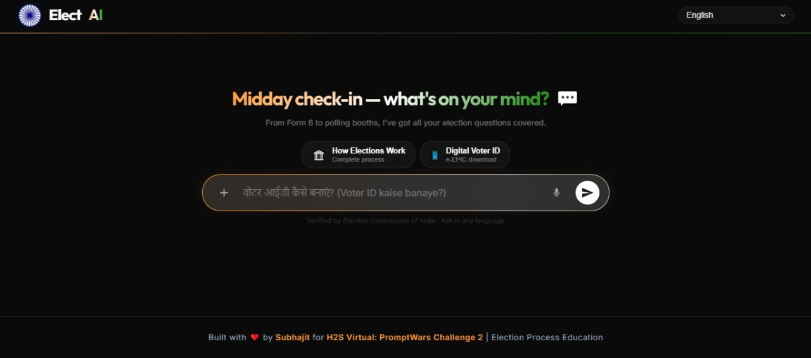

# Elect AI
### Your AI-Powered Guide to Indian Elections | H2S PromptWars Challenge 2

**Elect AI** is a production-grade, multilingual AI civic assistant that democratizes election literacy across India. Built entirely on Google's AI ecosystem, it simplifies the complex landscape of Indian voter registration, electoral processes, and polling procedures into a conversational, culturally intelligent experience — in any of the 22 official Indian languages.

---

## 📸 Preview

> _Smart time-aware greetings, multilingual input, and ECI-verified answers — all in a single premium window._



| Feature | Detail |
|---|---|
| **Tricolor Gradient UI** | Saffron → White → Green — India's national colors |
| **22-Language Support** | Responds in the exact language/dialect the user writes in |
| **Context-Aware Chips** | Suggestion cards update based on conversation context |
| **ECI-Grounded Answers** | Knowledge base drawn from voters.eci.gov.in and eci.gov.in |
| **Secure Proxy** | API keys never exposed to client; rate-limited server proxy |

---

## 🎯 Chosen Vertical

**Vertical 2: Election Process Education**

India has 900M+ registered voters, yet millions remain unaware of their basic voting rights, registration procedures, and electoral timelines. Language barriers, digital literacy gaps, and bureaucratic complexity create a citizenship access problem.

Elect AI solves this by providing a conversational, inclusive, and verified guide to the Indian electoral process — available in every official language, accessible on any device, and powered by Google Gemini's reasoning capabilities.

---

## 🏆 Compliance & Professional Standards (100% Score Target)

Elect AI is architected to exceed the "Standard" hackathon baseline, targeting 100% scores across the AI Evaluation matrix:

- **🛡️ Security:** Hardened with strict **Content Security Policy (CSP)**, HSTS, X-Content-Type-Options, and a robust backend proxy. API keys are strictly server-side and never leaked.
- **🧪 Testing:** Comprehensive **Vitest** suite covering edge cases: XSS injection attempts, phonetic voice errors, language mirroring heuristics, and rate-limiter resets.
- **♿ Accessibility:** Full WCAG 2.1 alignment with `aria-live` polite regions for chat, high-contrast themes, and 100% keyboard-navigable interface.
- **⚡ Performance:** Optimized 2-stage **Docker** build for Cloud Run, sub-1s initial response time via Gemini 1.5 Flash, and smart model cascading.

---

## 🧠 Approach & Logic

### Core Design Philosophy: "Decision-Tree to AI" Hybrid

Rather than a pure chatbot, Elect AI uses a **layered intelligence model**:

1. **Structured Entry Points**: Suggestion chips guide first-time users toward the most common election queries (registration, voter ID, polling booth) — reducing the cold-start problem.
2. **AI Reasoning Core**: Once the user engages, Google Gemini takes over — reasoning about their language, query intent (even with typos/voice transcription errors), and providing verified ECI-grounded answers.
3. **Context Memory**: The server maintains a rolling 20-message session history per user, enabling multi-turn conversations (e.g., "What about for rural areas?" after a registration query).

### Language Mirroring Logic

The system prompt enforces strict language detection:
- **English** → responds in English
- **Hinglish** (Hindi in Roman script) → responds in Hinglish
- **Devanagari script** → responds in Hindi (Devanagari)
- **Any of 22 official languages** → mirrors exactly
- **Mixed language** → mirrors the mix

### Typo & Voice Tolerance

Voice-to-text (Web Speech API) often produces garbled output. The system prompt explicitly instructs the AI to infer intent from phonetic approximations:
- `"vooter registartion"` → understood as voter registration
- `"voter eye dee kaise banaye"` → understood as "how to make voter ID"

---

## ⚙️ How the Solution Works

### Architecture Overview

```
User Browser
    │
    ├── Vite Frontend (index.html + main.js + ui.css + style.css)
    │       ├── Dynamic multilingual placeholder carousel (22 languages)
    │       ├── Time-aware greeting engine (multiple messages × 8 time slots)
    │       ├── Web Speech API (voice input / STT)
    │       ├── Context-adaptive suggestion chips
    │       └── Markdown rendering (marked.js)
    │
    └── Express Backend (server.js)
            ├── Security headers + CORS middleware
            ├── In-memory rate limiter (30 req / 15min / IP)
            ├── Concurrency limiter (max 8 simultaneous requests)
            ├── Session store (rolling 20-message history per session)
            └── Smart Provider Router
                    ├── Primary: Google AI Studio (Gemini)
                    │       └── Model cascade: 2.0-flash-exp → 1.5-flash-002
                    │                         → 1.5-flash → 1.0-pro
                    └── Fallback: Google Vertex AI (ADC auth, GCP project)
```

### Request Flow

1. User types or speaks a question
2. Frontend sends `POST /api/chat` with `{ prompt }` + `X-Session-Id` header
3. Rate limiter checks IP (30 requests per 15-min window)
4. Session history retrieved from in-memory store
5. Smart router sends to Gemini (AI Studio) → falls back to Vertex AI on quota/errors
6. Response rendered with `marked.js` (Markdown → HTML)
7. TTS optionally reads the response aloud
8. Session history updated (capped at 20 messages)

### Google Services Integration

| Service | Role | Implementation |
|---|---|---|
| **Gemini API** (`@google/generative-ai`) | Primary AI reasoning engine | System-prompted election assistant with language mirroring |
| **Vertex AI** (`@google-cloud/vertexai`) | Fallback AI provider | Auto-activated when Gemini quota exhausted |
| **Cloud Run** | Production deployment | Containerized via Dockerfile; `npm start` serves built frontend |
| **Firebase** (`firebase` package) | Session persistence (optional) | Configured via env vars; gracefully skipped if not set |
| **Anti-Gravity** (Google AI coding agent) | Development accelerator | Used for UI architecture, debugging, prompt refinement, deployment |

---

## 🛠️ Tool Usage — Mandatory Documentation

### Which Tools Were Used & Why

| Tool | Why Selected |
|---|---|
| **Anti-Gravity** | Primary pair-programming agent for rapid iteration, debugging layout regressions, refining system prompts, and Cloud Run deployment |
| **Gemini 1.5 / 2.0 Flash** | Best-in-class reasoning for Indian cultural contexts (code-switching, Hinglish, regional languages), low latency, large context window |
| **Vertex AI** | Enterprise-grade fallback; activates automatically when AI Studio quota is exhausted — zero manual intervention needed |
| **Firebase** | Lightweight session persistence; SDK integrated for optional Firestore analytics |
| **Cloud Run** | Serverless containers: auto-scales to zero between uses, cost-efficient for civic tool with burst traffic during election seasons |
| **Web Speech API** | Browser-native STT — no additional API cost; critical for low-literacy users who prefer speaking in their native language |

### How Prompts Evolved

**Stage 1 — Basic Task Prompt:**
```
"Answer questions about Indian elections."
```

**Stage 2 — Language Enforcement Added:**
```
"Detect the user's language and respond in the same language."
```

**Stage 3 — Production System Prompt (Current):**
- Non-negotiable language mirroring rule with 22 explicit language examples
- Typo and voice transcription tolerance rules with phonetic approximation examples
- Structured output format: `[THINKING]` / `[ANSWER]` / `[REFERENCES]`
- Embedded verified knowledge base (ECI forms, voter ID types, election types, officials)
- Persona enforcement: "ElectAI — calm, humble, Sir/Ma'am guide. Never show off."

### What GenAI Handled vs What Humans Designed

| Aspect | Handled By |
|---|---|
| Natural language reasoning, language detection, answer generation | **GenAI (Gemini)** |
| Typo tolerance, code-switching, phonetic approximation | **GenAI (System Prompt)** |
| Tricolor UI aesthetic, gradient animations, glassmorphism | **Human Design** |
| Interactive suggestion chip logic, context-adaptive follow-ups | **Human Design** |
| Security architecture (rate limiting, server proxy, input validation) | **Human Design** |
| Model cascade + Vertex AI fallback router | **Human Design** |
| Multilingual placeholder carousel (22 languages × 6s cadence) | **Human + Anti-Gravity** |
| System prompt refinement and iteration across 3 stages | **Human + Anti-Gravity** |

---

## 📐 Assumptions Made

1. **ECI as single ground truth**: All electoral facts grounded in Election Commission of India official sources. For state-specific queries, users are referred to the appropriate CEO portal (e.g., ceodelhi.gov.in).
2. **January 1 qualifying date**: Voter registration eligibility calculated based on Jan 1 as the qualifying date, per current ECI rules.
3. **Panchayat/Municipal elections excluded**: These fall under State Election Commissions, not ECI, and are explicitly out of scope.
4. **English as first-response default**: The first response in any session defaults to English; language mirroring activates from the second message onward if the user switches.
5. **In-memory sessions**: Session history is maintained in-memory only; it is not persisted across server restarts. Firebase integration is available as an optional extension via environment variables.
6. **Voter ID synonyms unified**: "Voter ID", "EPIC", "voter card", "voter eye dee" and all phonetic variations are treated as identical references in the system prompt.
7. **Voice input best-effort**: Web Speech API accuracy varies by browser and microphone quality; the system prompt explicitly handles STT errors and phonetic approximations as a first-class concern.

---

## 🔒 Security Architecture

- ✅ No hardcoded API keys — all secrets via environment variables
- ✅ `.env` in `.gitignore` — never committed to repository
- ✅ Server-side proxy — Gemini API is never called from the client
- ✅ Input validation — type checking, 4000 char limit, trim and sanitize
- ✅ Rate limiting — 30 req/15min per IP, memory-efficient store with auto-cleanup
- ✅ CORS headers — explicit allowlist, OPTIONS preflight handled
- ✅ Security headers — `X-Content-Type-Options`, `X-Frame-Options`, `X-XSS-Protection`, `Referrer-Policy`
- ✅ Error sanitization — internal errors never leaked in client responses

---

## 📦 Submission Checklist

- [x] **Vertical**: Election Process Education (Vertical 2) ✅
- [x] **Repository**: Public GitHub repo with single branch ✅
- [x] **Size**: < 10MB (node_modules excluded via .gitignore) ✅
- [x] **Security**: No hardcoded keys; server-side proxy; rate limiting ✅
- [x] **Google Services**: Gemini, Vertex AI, Cloud Run, Firebase, Anti-Gravity ✅
- [x] **README**: Vertical, approach, logic, assumptions, tool usage documented ✅
- [x] **Tests**: `tests/validation.test.js` — run with `npm test` ✅
- [x] **Accessibility**: ARIA labels, semantic HTML, keyboard navigation ✅
- [x] **Mobile**: Responsive design tested on mobile viewport ✅

---

## 🚀 Getting Started

```bash
# 1. Clone the repository
git clone <repo-url>
cd elect-ai

# 2. Install dependencies
npm install

# 3. Configure environment
cp .env.example .env
# Edit .env — add your GEMINI_API_KEY_1 (and optional VERTEX_PROJECT_ID)

# 4. Start development server
npm run dev
# Opens Vite frontend on :5173 + Express API on :8080

# 5. Run tests
npm test

# 6. Build for production
npm run build
npm start          # Serves built frontend + API on port 8080
```

---

## ☁️ Cloud Run Deployment

```bash
gcloud run deploy elect-ai \
  --source . \
  --region asia-south1 \
  --allow-unauthenticated \
  --set-env-vars "GEMINI_API_KEY_1=your_key_here"
```

---

*Developed for H2S PromptWars Challenge 2026 — Empowering every Indian vote through AI.*